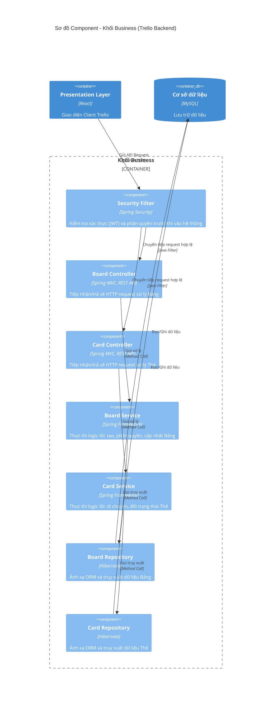

```mermaid
C4Component
    title Sơ đồ Component - Khối Business (Trello Backend)

    Container(webapp, "Presentation Layer", "React", "Giao diện Client Trello")
    ContainerDb(db, "Cơ sở dữ liệu", "MySQL", "Lưu trữ dữ liệu")

    Container_Boundary(business, "Khối Business") {
        
        Component(security, "Security Filter", "Spring Security", "Kiểm tra xác thực (JWT) và phân quyền trước khi vào hệ thống")
        
        Component(boardController, "Board Controller", "Spring MVC, REST API", "Tiếp nhận/trả về HTTP request xử lý Bảng")
        Component(cardController, "Card Controller", "Spring MVC, REST API", "Tiếp nhận/trả về HTTP request xử lý Thẻ")

        Component(boardService, "Board Service", "Spring Framework", "Thực thi logic lõi: tạo, phân quyền, cập nhật Bảng")
        Component(cardService, "Card Service", "Spring Framework", "Thực thi logic lõi: di chuyển, đổi trạng thái Thẻ")

        Component(boardRepo, "Board Repository", "Hibernate", "Ánh xạ ORM và truy xuất dữ liệu Bảng")
        Component(cardRepo, "Card Repository", "Hibernate", "Ánh xạ ORM và truy xuất dữ liệu Thẻ")
    }


    Rel(webapp, security, "Gửi API Request", "JSON/HTTPS")
    
    Rel(security, boardController, "Chuyển tiếp request hợp lệ", "Java Filter")
    Rel(security, cardController, "Chuyển tiếp request hợp lệ", "Java Filter")

    Rel(boardController, boardService, "Gọi xử lý", "Method Call")
    Rel(cardController, cardService, "Gọi xử lý", "Method Call")

    Rel(boardService, boardRepo, "Gọi truy xuất", "Method Call")
    Rel(cardService, cardRepo, "Gọi truy xuất", "Method Call")

    Rel(boardRepo, db, "Đọc/Ghi dữ liệu")
    Rel(cardRepo, db, "Đọc/Ghi dữ liệu")
```
