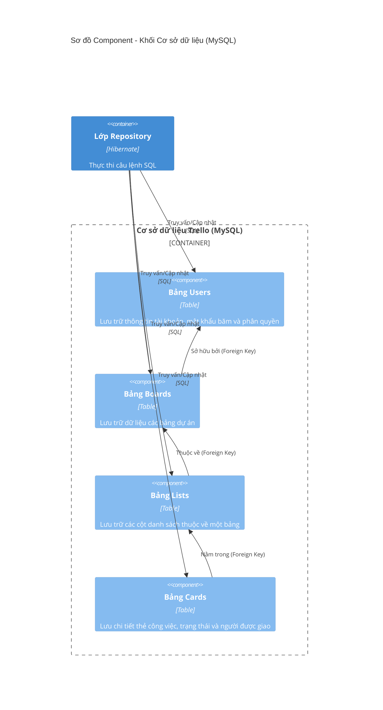

```mermaid
C4Component
    title Sơ đồ Component - Khối Cơ sở dữ liệu (MySQL)

    Container(repository, "Lớp Repository", "Hibernate", "Thực thi câu lệnh SQL")

    Container_Boundary(database, "Cơ sở dữ liệu Trello (MySQL)") {
        
        Component(userTable, "Bảng Users", "Table", "Lưu trữ thông tin tài khoản, mật khẩu băm và phân quyền")
        Component(boardTable, "Bảng Boards", "Table", "Lưu trữ dữ liệu các bảng dự án")
        Component(listTable, "Bảng Lists", "Table", "Lưu trữ các cột danh sách thuộc về một bảng")
        Component(cardTable, "Bảng Cards", "Table", "Lưu chi tiết thẻ công việc, trạng thái và người được giao")
        
    }

    Rel(repository, userTable, "Truy vấn/Cập nhật", "SQL")
    Rel(repository, boardTable, "Truy vấn/Cập nhật", "SQL")
    Rel(repository, listTable, "Truy vấn/Cập nhật", "SQL")
    Rel(repository, cardTable, "Truy vấn/Cập nhật", "SQL")
    
    Rel(boardTable, userTable, "Sở hữu bởi (Foreign Key)")
    Rel(listTable, boardTable, "Thuộc về (Foreign Key)")
    Rel(cardTable, listTable, "Nằm trong (Foreign Key)")
```
