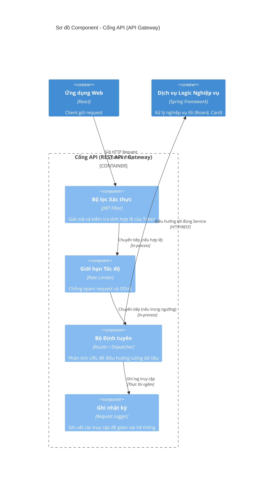

```mermaid
C4Component
    title Sơ đồ Component - Cổng API (API Gateway)

    Container(webapp, "Ứng dụng Web", "React", "Client gửi request")
    Container(business, "Dịch vụ Logic Nghiệp vụ", "Spring Framework", "Xử lý nghiệp vụ lõi (Board, Card)")

    Container_Boundary(apiGateway, "Cổng API (REST API / Gateway)") {
        
        Component(authFilter, "Bộ lọc Xác thực", "JWT Filter", "Giải mã và kiểm tra tính hợp lệ của Token")
        Component(rateLimiter, "Giới hạn Tốc độ", "Rate Limiter", "Chống spam request và DDoS")
        Component(router, "Bộ Định tuyến", "Router / Dispatcher", "Phân tích URL để điều hướng luồng dữ liệu")
        Component(logger, "Ghi nhật ký", "Request Logger", "Ghi vết các truy cập để giám sát hệ thống")
    }

    Rel(webapp, authFilter, "Gửi HTTP Request", "JSON/HTTPS")
    Rel(authFilter, rateLimiter, "Chuyển tiếp (nếu hợp lệ)", "In-process")
    Rel(rateLimiter, router, "Chuyển tiếp (nếu trong ngưỡng)", "In-process")
    Rel(router, logger, "Ghi log truy cập", "Thực thi ngầm")
    
    Rel(router, business, "Điều hướng tới đúng Service", "HTTP/REST")
```
