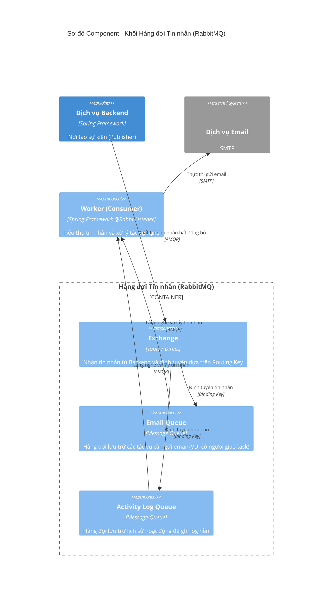

```mermaid
C4Component
    title Sơ đồ Component - Khối Hàng đợi Tin nhắn (RabbitMQ)

    Container(business, "Dịch vụ Backend", "Spring Framework", "Nơi tạo sự kiện (Publisher)")
    System_Ext(emailService, "Dịch vụ Email", "SMTP", "Gửi thông báo thực tế")

    Container_Boundary(rabbitmq, "Hàng đợi Tin nhắn (RabbitMQ)") {
        Component(exchange, "Exchange", "Topic / Direct", "Nhận tin nhắn từ Backend và định tuyến dựa trên Routing Key")
        Component(emailQueue, "Email Queue", "Message Queue", "Hàng đợi lưu trữ các tác vụ cần gửi email (VD: có người giao task)")
        Component(activityQueue, "Activity Log Queue", "Message Queue", "Hàng đợi lưu trữ lịch sử hoạt động để ghi log nền")
    }
    
    Component(worker, "Worker (Consumer)", "Spring Framework @RabbitListener", "Tiêu thụ tin nhắn và xử lý tác vụ nặng")

    Rel(business, exchange, "Xuất bản tin nhắn bất đồng bộ", "AMQP")
    Rel(exchange, emailQueue, "Định tuyến tin nhắn", "Binding Key")
    Rel(exchange, activityQueue, "Định tuyến tin nhắn", "Binding Key")
    
    Rel(emailQueue, worker, "Lắng nghe và lấy tin nhắn", "AMQP")
    Rel(activityQueue, worker, "Lắng nghe và lấy tin nhắn", "AMQP")
    
    Rel(worker, emailService, "Thực thi gửi email", "SMTP")
```
