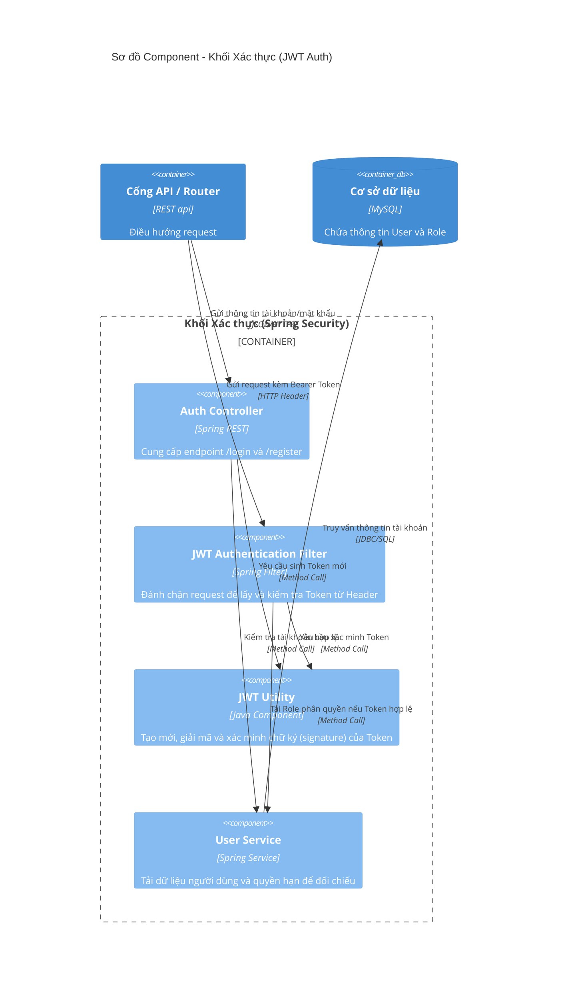

```mermaid
C4Component
    title Sơ đồ Component - Khối Xác thực (JWT Auth)

    Container(api, "Cổng API / Router", "REST api", "Điều hướng request")
    ContainerDb(db, "Cơ sở dữ liệu", "MySQL", "Chứa thông tin User và Role")

    Container_Boundary(auth_service, "Khối Xác thực (Spring Security)") {
        
        Component(authController, "Auth Controller", "Spring REST", "Cung cấp endpoint /login và /register")
        Component(jwtFilter, "JWT Authentication Filter", "Spring Filter", "Đánh chặn request để lấy và kiểm tra Token từ Header")
        Component(jwtProvider, "JWT Utility", "Java Component", "Tạo mới, giải mã và xác minh chữ ký (signature) của Token")
        Component(userService, "User Service", "Spring Service", "Tải dữ liệu người dùng và quyền hạn để đối chiếu")
    }

    Rel(api, authController, "Gửi thông tin tài khoản/mật khẩu", "JSON/HTTPS")
    Rel(api, jwtFilter, "Gửi request kèm Bearer Token", "HTTP Header")

    Rel(authController, userService, "Kiểm tra tài khoản hợp lệ", "Method Call")
    Rel(authController, jwtProvider, "Yêu cầu sinh Token mới", "Method Call")

    Rel(jwtFilter, jwtProvider, "Yêu cầu xác minh Token", "Method Call")
    Rel(jwtFilter, userService, "Tải Role phân quyền nếu Token hợp lệ", "Method Call")

    Rel(userService, db, "Truy vấn thông tin tài khoản", "JDBC/SQL")

```
