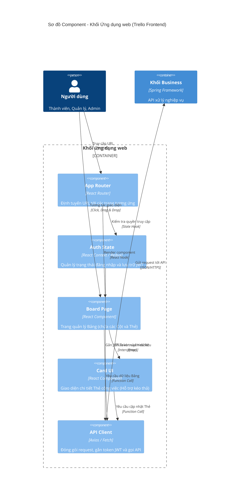

```mermaid
  C4Component
      title Sơ đồ Component - Khối Ứng dụng web (Trello Frontend)
      Person(user, "Người dùng", "Thành viên, Quản lý, Admin")
      Container(backend, "Khối Business", "Spring Framework", "API xử lý nghiệp vụ")
      Container_Boundary(web, "Khối ứng dụng web") {
          Component(router, "App Router", "React Router", "Định tuyến URL tới các trang tương ứng")
          Component(authContext, "Auth State", "React Context / Redux", "Quản lý trạng thái đăng nhập và lưu trữ JWT")
          
          Component(boardPage, "Board Page", "React Component", "Trang quản lý Bảng (chứa các Cột và Thẻ)")
          Component(cardUI, "Card UI", "React Component", "Giao diện chi tiết Thẻ công việc (Hỗ trợ kéo thả)")
  
          Component(apiClient, "API Client", "Axios / Fetch", "Đóng gói request, gắn token JWT và gọi API")
          
      }
      Rel(user, router, "Truy cập URL", "HTTPS")
      Rel(user, boardPage, "Tương tác giao diện", "Click, Drag & Drop")
      
      Rel(router, authContext, "Kiểm tra quyền truy cập", "State Hook")
      Rel(router, boardPage, "Render component", "React Node")
      
      Rel(boardPage, cardUI, "Chứa và truyền dữ liệu", "Props")
      
      Rel(boardPage, apiClient, "Yêu cầu dữ liệu Bảng", "Function Call")
      Rel(cardUI, apiClient, "Yêu cầu cập nhật Thẻ", "Function Call")
      Rel(authContext, apiClient, "Gắn JWT Token vào Header", "Interceptor")
  
      Rel(apiClient, backend, "Gửi request tới API", "JSON/HTTPS")
```
