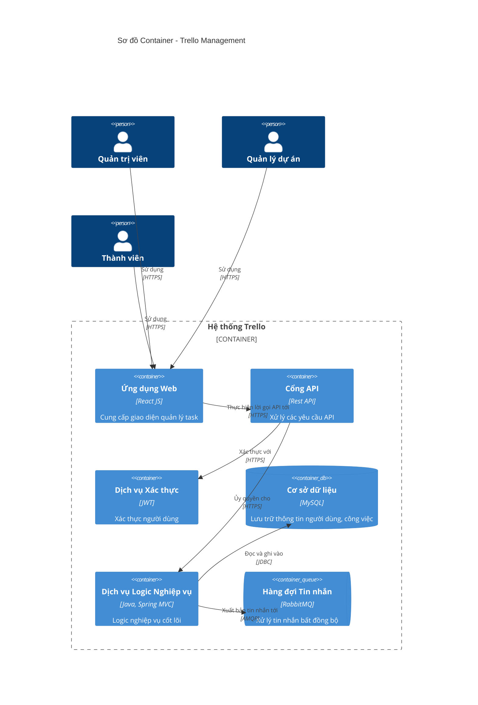

```mermaid
C4Container
    title Sơ đồ Container - Trello Management

    Person(admin, "Quản trị viên")
    Person(manager, "Quản lý dự án")
    Person(member, "Thành viên")

    Container_Boundary(c1, "Hệ thống Trello") {
        Container(webapp, "Ứng dụng Web", "React JS", "Cung cấp giao diện quản lý task")
        Container(api, "Cổng API", "Rest API", "Xử lý các yêu cầu API")
        Container(auth, "Dịch vụ Xác thực", "JWT", "Xác thực người dùng")
        ContainerDb(db, "Cơ sở dữ liệu", "MySQL", "Lưu trữ thông tin người dùng, công việc")
        Container(business, "Dịch vụ Logic Nghiệp vụ", "Java, Spring MVC", "Logic nghiệp vụ cốt lõi")
        ContainerQueue(messageQueue, "Hàng đợi Tin nhắn", "RabbitMQ", "Xử lý tin nhắn bất đồng bộ")  
    }
    Rel(admin, webapp, "Sử dụng", "HTTPS")
    Rel(manager, webapp, "Sử dụng", "HTTPS")
    Rel(member, webapp, "Sử dụng", "HTTPS")
    Rel(webapp, api, "Thực hiện lời gọi API tới", "HTTPS")
    Rel(api, auth, "Xác thực với", "HTTPS")
    Rel(api, business, "Ủy quyền cho", "HTTPS")
    Rel(business, db, "Đọc và ghi vào", "JDBC")
    Rel(business, messageQueue, "Xuất bản tin nhắn tới", "AMQP")
```
